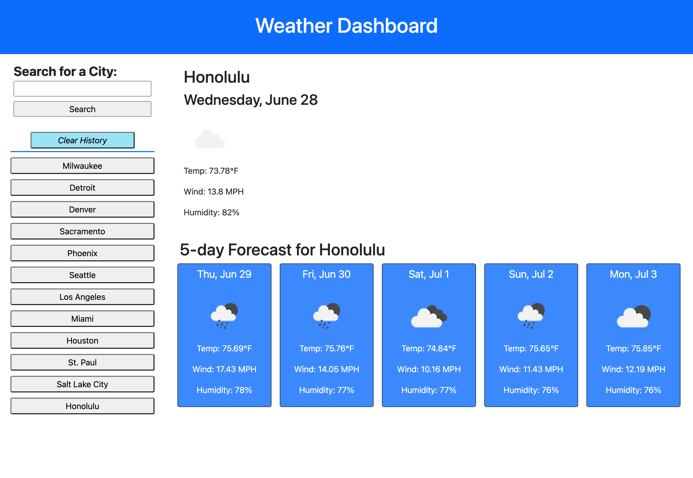

# Weather Forecaster

## Description
A weather dashboard. Users input a city name and it returns the current weather and a five-day forecast. 

[Weather Forecaster](https://uwlryoung.github.io/weather-forecaster/)

## Screenshots

## Steps
- Search for a city by typing the name of a city into the search bar. The name must be the exact spelling, which either includes all correct puncuation or no puncuation at all. 
    - Example: "Washington DC" and "Washington, D.C." both work, but not "Washington, DC". 
- When the search button is clicked (or Enter is pressed), it will render the current weather of that location to the page, and render a 5-day forecast to the page. It will also render a search history button to the left of the screen (if that city is not already there). 
- Click on a city button from the search history to re-render that city's current weather and 5-day forecast. 
- Click on "Clear History" to clear the local storage and therefore remove all the search history buttons. 

## Usage
To tell the weather.

## Credits / Used Sources
[dayjs](https://day.js.org/) 

[jquery](https://jquery.com/)

[bootstrap](https://getbootstrap.com/)

## Challenges To Work On / Future Updates to this Page
- Prevent a user from entering in a city that doesn't exist
- Use an API to have a dropdown search when typing in cities (e.g. with Google Maps) 
- Use location services so that it finds the closest city you are looking for (e.g., Alexandria, VA, not Alexandria, Egypt)
- Order the search history buttons in alphabetical order
- Have the city name show up at the same time as the weather information (the title renders slightly ahead of the weather forecast)
- The search history buttons will show the exact case that a user inputs (e.g., if they type "madison", the "m" is still lowercase). When rendering the buttons, make it so that even when the first letter is lowercase on the input, automatically capitialize where needed.

## License
N/A

